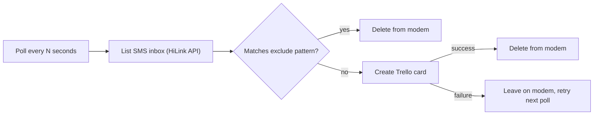

# pi-sms

A Python 3.13 background service for Raspberry Pi that receives SMS via a Huawei E3372 HiLink modem, filters out known-noise messages, and creates a Trello card for each remaining message.

## Features

- **SMS polling**: Regularly checks the E3372 HiLink modem's SMS inbox via its web API (no AT commands, no serial port)
- **Pattern filtering**: Discards messages matching configured regex patterns (e.g. Free Mobile voicemail notifications) without creating a card
- **Trello card creation**: One card per kept message, in a configured Trello list, via the Trello REST API
- **Self-cleaning inbox**: Each message is deleted from the modem once handled (card created, or filtered out) so the modem's limited SMS storage never fills up; a Trello failure leaves the message for the next poll to retry
- **Isolated modem networking**: Setup provisions a static, never-default network profile for the modem's USB interface, bound by MAC address so it's reachable on every boot without ever disrupting the Pi's LAN connection
- **Systemd service**: Auto-start, auto-restart, journald logging

## Requirements

- Raspberry Pi (any model with NetworkManager and a spare USB port)
- Python 3.13.5 (already included on Raspberry Pi OS)
- Huawei E3372 in HiLink mode (USB ID `12d1:14dc`), with an active SIM
- A Trello account, API key and token, and a destination list

## How it works



The E3372 in HiLink mode presents itself as a USB network card (typically `eth1`) hosting a web API at `http://192.168.8.1`. There is no `/dev/ttyUSB*` device and no AT command interface. Every state-changing API call (listing or deleting SMS) requires a fresh session token fetched immediately beforehand from `/api/webserver/SesTokInfo` (a CSRF-style flow).

## Installation

### One-command install

On the target Raspberry Pi, run:

```bash
curl -fsSL https://raw.githubusercontent.com/CaenFalaisePlaneurs/pi-sms/main/scripts/install.sh | sh
```

This installs the base tools, creates the virtual environment, installs the
package, and runs the setup (modem network profile, systemd service, config
template) using the packaged `config.example.yaml`. After it finishes, edit
`/etc/pi-sms/config.yaml` and start the service:

```bash
sudo nano /etc/pi-sms/config.yaml
sudo systemctl start pi-sms
```

If you prefer to verify every step manually, follow the steps below instead.

### Step 1: Create a virtual environment

python3 -m venv ~/pi-sms-venv

### Step 2: Install the software

~/pi-sms-venv/bin/pip install git+https://github.com/CaenFalaisePlaneurs/pi-sms.git

### Step 3: Run the setup

This command will:

- Provision the modem's network interface (static IP, isolated from the LAN default route)
- Create the systemd service
- Create the configuration file template
- Enable the service to start on boot

sudo /home/$(whoami)/pi-sms-venv/bin/python -m pi_sms.setup.setup

### Step 4: Configure the software

sudo nano /etc/pi-sms/config.yaml

Set at minimum:

- `trello.key`, `trello.token`, `trello.list_id`
- `filter.exclude_patterns` if you want to add more patterns beyond the Free Mobile voicemail example

### Step 5: Start the service

sudo systemctl start pi-sms

### Step 6: Check if it's working

sudo systemctl status pi-sms
sudo journalctl -u pi-sms -f

## Modem networking

The E3372's web API is only reachable once its USB network interface has an IP address in the modem's subnet. On a Pi with an onboard NIC, both the modem and the onboard NIC are USB-attached ethernet devices, so the kernel's `eth0`/`eth1` naming can differ on every boot. If a generic DHCP profile ends up activating on the modem interface instead of the LAN NIC, the modem's own DHCP server hands out a lease and hijacks the default route, dropping the Pi off the LAN entirely.

To avoid that boot race, `pi_sms.setup.setup` binds NetworkManager connections to **MAC addresses** instead of interface names:

- The modem is detected by its Huawei USB vendor ID (`12d1`) and provisioned as a NetworkManager connection (`pi-sms-modem`) bound to its MAC address, with:
  - A static address (`192.168.8.100/24`), matching the modem's default subnet
  - `ipv4.never-default yes` and IPv6 disabled, so it can never hijack the Pi's default route or LAN connectivity
  - `connection.autoconnect yes`, so it comes up automatically on every boot
- The Pi's onboard NIC (found via the current default route) has its existing LAN connection pinned to its MAC address, so that connection can only ever activate on the real LAN NIC, never on the modem

Both bindings are applied non-disruptively via `nmcli connection modify` and only affect where each profile lands on the next activation or boot.

The modem profile can be inspected or removed with standard `nmcli` commands:

nmcli connection show pi-sms-modem
sudo nmcli connection delete pi-sms-modem

## Configuration

See [config.example.yaml](config.example.yaml) for all configuration options, including:

- `modem`: base URL and request timeout for the HiLink API
- `poll`: how often to check the inbox
- `filter`: regex patterns for messages to discard without a card
- `trello`: API key/token, destination list, and card title/description templates
- `debug`: faster poll interval when `DEBUG_MODE=true`

## Service Management

sudo systemctl start pi-sms
sudo systemctl stop pi-sms
sudo systemctl restart pi-sms
sudo systemctl status pi-sms
sudo systemctl disable pi-sms
sudo systemctl enable pi-sms

## Troubleshooting

### Service won't start

sudo journalctl -u pi-sms -n 50

### Viewing logs live / seeing all received SMS

sudo journalctl -u pi-sms -f

In normal mode, only card creations are logged (`Created Trello card for SMS from {phone}`); everything else (inbox poll counts, filtered messages, Trello failures) is silent. Two things affect what you see:

- The daemon is line-buffered by Python but journald only flushes on buffer boundaries, so `-f` can appear to lag in bursts rather than truly live. To force unbuffered output, add an override:

  sudo systemctl edit pi-sms

  Add under `[Service]`:

  Environment=PYTHONUNBUFFERED=1

  Then `sudo systemctl restart pi-sms`.

- To log every received/filtered message (not just successful card creations), set `DEBUG_MODE=true` in the same override (also switches to the faster `debug.poll_interval_seconds` from the config instead of `poll.interval_seconds`):

  Environment=DEBUG_MODE=true

### Recovering the Pi if it drops off the LAN

If the Pi becomes unreachable over SSH/LAN (e.g. after manually bringing up the modem interface with plain DHCP instead of the `pi-sms-modem` profile), recover it from the physical console:

sudo nmcli device disconnect eth1
sudo nmcli device connect eth0
ip -br addr show eth0

The MAC-based bindings set up by `pi_sms.setup.setup` (see "Modem networking" above) prevent this from happening at boot, but a manual `nmcli device connect <modem-interface>` can still trigger it.

### Sending a test SMS manually

Useful to confirm the modem and SIM can actually send, independent of the daemon. Run on the Pi (needs the modem's session-token flow):

```bash
PHONE="+33612345678"
MSG="Hello from the Pi modem"

M=http://192.168.8.1
R=$(curl -s -m6 "$M/api/webserver/SesTokInfo")
SID=$(echo "$R" | sed -n 's:.*<SesInfo>\(.*\)</SesInfo>.*:\1:p')
TOK=$(echo "$R" | sed -n 's:.*<TokInfo>\(.*\)</TokInfo>.*:\1:p')
curl -s -m10 \
  -H "Cookie: $SID" \
  -H "__RequestVerificationToken: $TOK" \
  -H "Content-Type: text/xml" \
  -d "<?xml version='1.0' encoding='UTF-8'?><request><Index>-1</Index><Phones><Phone>${PHONE}</Phone></Phones><Sca></Sca><Content>${MSG}</Content><Length>${#MSG}</Length><Reserved>1</Reserved><Date>$(date '+%Y-%m-%d %H:%M:%S')</Date></request>" \
  "$M/api/sms/send-sms"; echo
```

A successful send returns `<response>OK</response>`. Check SIM/signal readiness first if it fails (see "No SIM / no signal" below): `SimStatus` must be `1` and `SignalIcon` greater than `0`.

### Modem unreachable

Check the network profile is active and the modem answers:

nmcli -t -f DEVICE,STATE device
ip -br addr show eth1
curl -s -o /dev/null -w '%{http_code}\n' http://192.168.8.1/

### No SIM / no signal

Check SIM and signal status directly:

curl -s http://192.168.8.1/api/webserver/SesTokInfo

then use the returned `SesInfo`/`TokInfo` to call `/api/monitoring/status` with the `Cookie` and `__RequestVerificationToken` headers, and look for `SimStatus` (`1` = OK, `255` = no SIM detected) and `SignalIcon`.

## Development

source venv/bin/activate  # after scripts/setup-venv.sh
pip install -r requirements-dev.txt
ruff check pi_sms tests && black --check pi_sms tests && mypy pi_sms && pytest tests/

Or use the Cursor commands `/quality-check` and `/quality-fix`.

## Uninstallation

Stop and disable the service, then remove the package:

```bash
sudo ~/pi-sms-venv/bin/python -m pi_sms.setup.uninstall
~/pi-sms-venv/bin/pip uninstall pi-sms
```

Optionally remove the modem network profile and the virtual environment:

```bash
sudo nmcli connection delete pi-sms-modem
rm -rf ~/pi-sms-venv
```

Configuration at `/etc/pi-sms/config.yaml` is preserved (following Debian best practices).

## License

MIT - See [LICENSE](LICENSE) for details.
